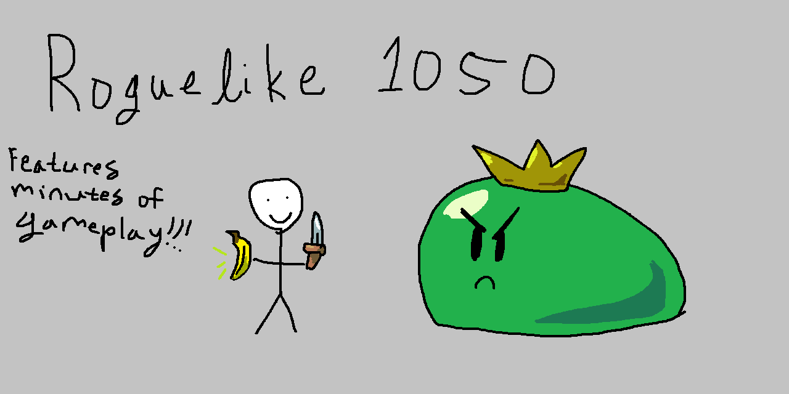

# Roguelike 1050
### A project for CPSC 1050 at Clemson University
### Written by David Wilson Knowles V

In order to run the game, run the file `game.py`. There is also an optional command line argument to include a seed:

For example:
`python3 game.py` runs the game, while `python3 game.py 3993251957` runs the game AND sets the random seed to 3993251957.

When running the game, all files posted in the repository are necessary to have, except for `test_dp.py`, `test_mg.py`, and `test_player.py`, as well as any files contained under `dictionaries/testing`. All other dictionary `.txt` files must be kept within the `dictionaries` folder.

**NOTE:**

I wrote this program using python version 3.12.3 on Ubuntu. I didn't know this at the time, but f-strings cannot have nested quotes on older versions of Python, including 3.10. In order for the program to run, python3 version 3.12.3 is the minimum I would recommend, but I believe anything higher should also work. 

## Player Actions

When playing the game, you must type in these commands in order to progress in the game:

*Note: These commands are not case sensitive!*

### Everyday Actions

These are actions that can be performed at any point in the game.

`INVENTORY`: Displays the player's inventory.

`MAP`: Displays the dungeon map.

`SELF`: Displays the player's stats.

`ITEM n`: Displays the stats of an item in the player's inventory. `n` must be the ID of an item contained in the player's inventory. Item IDs can be checked by calling `INVENTORY`.

### Battle Actions

These are actions that can only be performed while in a battle.

`CHECK n`: Displays the stats of an enemy. `n` must be the ID of an enemy the player is facing in battle.

`ATTACK n`: Attacks the enemy! `n` must be the ID of an enemy the player is facing in battle.

`EQUIP n`: Equips a weapon from the player's inventory. `n` must be the ID of a weapon contained in the player's inventory. Item IDs can be checked by calling `INVENTORY`.

`USE n`: Uses a consumable from the player's inventory. `n` must be the ID of a consumable contained in the player's inventory. Item IDs can be checked by calling `INVENTORY`.

### Shop Actions

These are actions that can only be performed while in the shop.

`BUY n`: Purchases an item from the shop if the player has enough money. `n` must be the ID of an item in the shop.

`LEAVE`: Leaves the shop.

### Navigation Actions

These are actions that can only be performed while navigating between rooms.

`NEXT`: Moves the player to the next room. If the player comes across a split path, they will be prompted to pick which room to continue to.

`CONTINUE`: Does the exact same thing as `NEXT`

## Map Key

`F`: Enemy Encounter

`B`: Boss Encounter

`M`: Miniboss Encounter

`X`: Treasure Room

`$`: Shop

`H`: Healing Fountain

`O`: Room the Player is currently at.

## Damage Types

`Physical`: Boosted by the `Attack` stat and resisted by the `Defense` stat.

`Special`: Boosted by the `Special Attack` stat and resisted by the `Special Defense` stat.

`Piercing`: Directly deals damage, ignores all player and enemy stats.

## General Info

The scope of this project is something I've never actually done before, so I do apologize for the spaghetti code. 

I started working on this sometime in late March, and the first playable build was finished 4/26/2025.

I updated the game on 4/28/2025 and added a new weapon, a new miniboss enemy, some bugfixes, some polish, and some randomness when attacking to help make the battles feel more dynamic. Specifically, map rendering was changed from using special unicode characters to using ASCII characters. This should hopefully help prevent any crashing due to some terminals not having as great of unicode support.

I wasn't able to do as much play-testing as I wanted to, so if you come across any bugs, please let me know at dknowle@clemson.edu. To my knowledge, the program runs relatively smoothly, so there shouldn't be any errors encountered.

If you want to mod an enemy or item into the game, add an entry to the corresponding `.txt` file in `dictionaries`. If you want to add custom functionality to the modded item or enemy, add the functionality in `fx_consumable.py` or `enemy_actions.py` and update the dictionaries in said files. 
